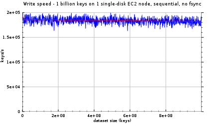

<h3>
obigstore is an open-source database that exposes a multidimensional
BigTable-like data model. It inherits Google LevelDB's fundamental strengths,
such as fast random writes or control over the physical data layout. It can be
used in a client/server setting or as an embedded database.
</h3>

<a href="doc.html">Read more →</a>

------------------

<h4> strong data durability guarantees </h4>

<ul>
<li><strong>fully fsync'ed writes</strong> with group commit</li>
<li>data integrity ensured with <strong>CRCs at the protocol
level</strong></li>
<li>synchronous and asynchronous <strong>replication</strong></li>
<li><strong>online backup</strong></li>

<h4>rich semi-structured data model</h4>
<ul>
<li><strong>atomic transactions</strong> (both read-committed and repeatable-read isolation levels)</li>
<li>optimistic and pessimistic <strong>concurrency control</strong></li>
<li>asynchronous notifications</li>
<li>limited support for complex documents (BSON serialized)</li>
<li>support for composite keys (REPL and client lib)</li>
</ul>

<h4>performance</a></h4>
<ul>
<li>fast <strong>random writes</strong></li>
<li><strong>efficient range queries</strong> thanks to <strong>spatial
locality</strong></li>
<li>cross-record <strong>redundancy reduction</strong> at the page level (snappy
compression)</li>
<li>fast recovery (independent of dataset size)</li>
</ul>
<a href="benchmarks.html">Read more →</a>

<!-- vim: set ft=markdown: -->
